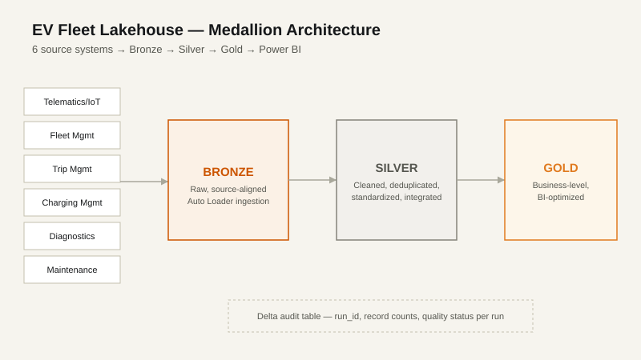

# EV Fleet Lakehouse Platform

**A Databricks Lakehouse design for a commercial EV fleet: six operational source systems flowing through Bronze, Silver and Gold Delta tables into fleet KPIs that operations teams can act on.**


<p align="center">
  
</p>

> **Where this project stands:** the requirements, data model, KPI catalogue and architecture are complete and documented in [`project_requirements.md`](project_requirements.md). The Bronze/Silver/Gold pipeline build and the Power BI report layer are the next phase. This README describes the design; it doesn't claim a running pipeline yet.

Built during my Data Engineering internship at KaarTech.

---

## The business problem

A fleet operator running thousands of connected delivery vehicles has its data spread across six systems with different structures and update rates. Without one reliable platform, basic questions go unanswered:

| Area | Question the platform must answer |
|---|---|
| Utilization | Which vehicles are under- or over-utilized? |
| Battery | Which vehicles show abnormal consumption or declining efficiency? |
| Charging | Where are sessions slow, long or inefficient? |
| Vehicle health | Which vehicles repeatedly raise diagnostic faults? |
| Maintenance | Which vehicles are due or overdue for service? |
| Safety | Which vehicles or drivers show speeding or harsh braking? |

## Source systems

| # | System | What it contributes |
|---|---|---|
| 1 | Telematics / IoT | GPS, speed, odometer, battery SoC, voltage and temperature, motor temperature |
| 2 | Fleet management | Vehicle master data: model, battery capacity, depot, status |
| 3 | Trip management | Completed trips: distance, duration, energy consumed |
| 4 | Charging management | Charging sessions: charger, station, energy delivered, SoC gain |
| 5 | Vehicle diagnostics | Fault events from the vehicle and battery management system |
| 6 | Maintenance management | Workshop and service records, costs, downtime |

## Architecture

| Layer | Contract |
|---|---|
| **Bronze** | Raw, source-aligned, append-only ingestion with Auto Loader. Nothing is cleaned here, so every downstream number traces back to its source. |
| **Silver** | Cleaned, validated, deduplicated, standardized and integrated across systems. Reprocessing the same batch must not create duplicate business records. |
| **Gold** | Business-level, aggregated and BI-optimized tables that serve Power BI KPIs without Power BI doing any cleaning. |

Design requirements carried into the build:

- **Bad records never reach Gold unnoticed.** The target is that 100% of Gold records pass the defined critical data-quality rules before publication. That's a statement about the pipeline, not a claim that source data is clean.
- **Delta Lake is used for its guarantees, not just as a file format:** ACID writes, `MERGE` upserts, schema enforcement and evolution, time travel, table history, `OPTIMIZE` and `VACUUM`.
- **Every run is auditable.** Each execution writes `run_id`, per-layer record counts, inserted / updated / rejected counts and a quality status to a Delta audit table.
- **Governed by Unity Catalog:** catalog / schema / table organization, ownership, permissions and lineage where supported.
- **Incremental by default.** New source data is processed without reprocessing history.

## KPI catalogue

30 KPIs across five domains, each mapped to a Power BI report page. Full definitions are in [`project_requirements.md`](project_requirements.md).

| Domain | Examples |
|---|---|
| Fleet | Fleet utilization %, active vehicles, avg distance and trips per vehicle, idle time |
| Battery & energy | Average SoC, energy efficiency (km/kWh), low-SoC and high-temperature events |
| Charging | Sessions, energy delivered, avg charging duration, SoC gain, charger utilization % |
| Maintenance & reliability | Downtime hours, overdue maintenance, cost per vehicle, mean time between failures |
| Safety | Speeding, harsh braking and harsh acceleration events, safety events per 100 km |

Planned report pages: Fleet Executive Overview, Fleet Utilization, Battery & Energy, Charging Performance, Vehicle Health & Maintenance, Safety & Operations.

## Stack

| Concern | Choice |
|---|---|
| Platform | Databricks (Free Edition) with Unity Catalog Volumes |
| Processing | Apache Spark / PySpark, Databricks SQL |
| Storage | Delta Lake |
| Ingestion | Databricks Auto Loader, Spark Structured Streaming |
| Governance | Unity Catalog |
| Serving | Power BI |
| Languages & config | Python, SQL, YAML + environment variables |
| Monitoring | Databricks logs + Delta audit tables |

Orchestration and Gold-layer modeling tools are still open design choices for the build phase and aren't part of the work shown here.

## Repository contents

```
EV-Fleet-Lakehouse-Platform/
├── project_requirements.md   # Business problem, source systems, entities, KPIs, success criteria
└── docs/
    └── architecture.svg      # Medallion architecture diagram
```

## Roadmap

- [x] Business problem, source-system model and entity relationships
- [x] KPI catalogue and Power BI page design
- [x] Medallion architecture and success criteria
- [ ] Synthetic source datasets committed to the repo
- [ ] Bronze ingestion with Auto Loader
- [ ] Silver validation and deduplication with data-quality tests
- [ ] Gold KPI tables and audit table
- [ ] Power BI report

---

Built by [Pavithra Uthrah R K](https://github.com/uthrahh) · [Portfolio](https://uthrahrk.vercel.app)
